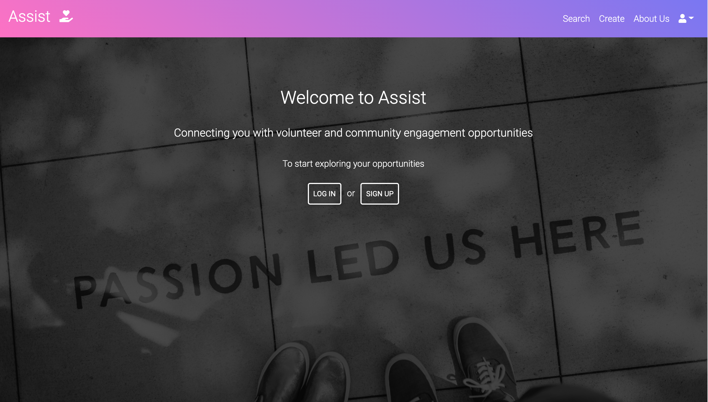
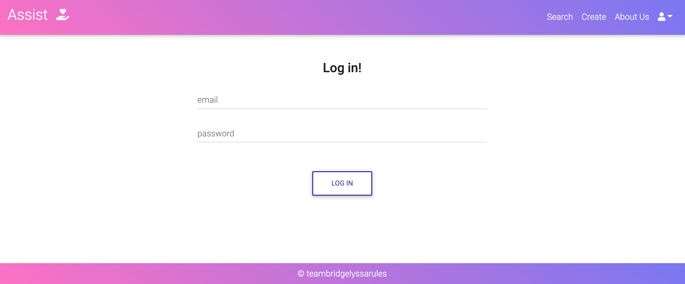
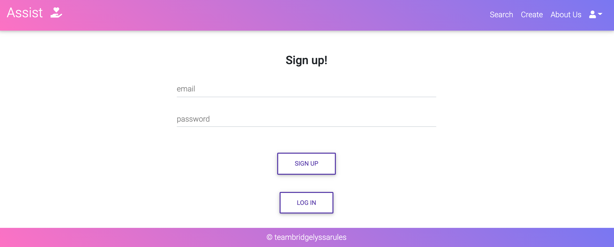
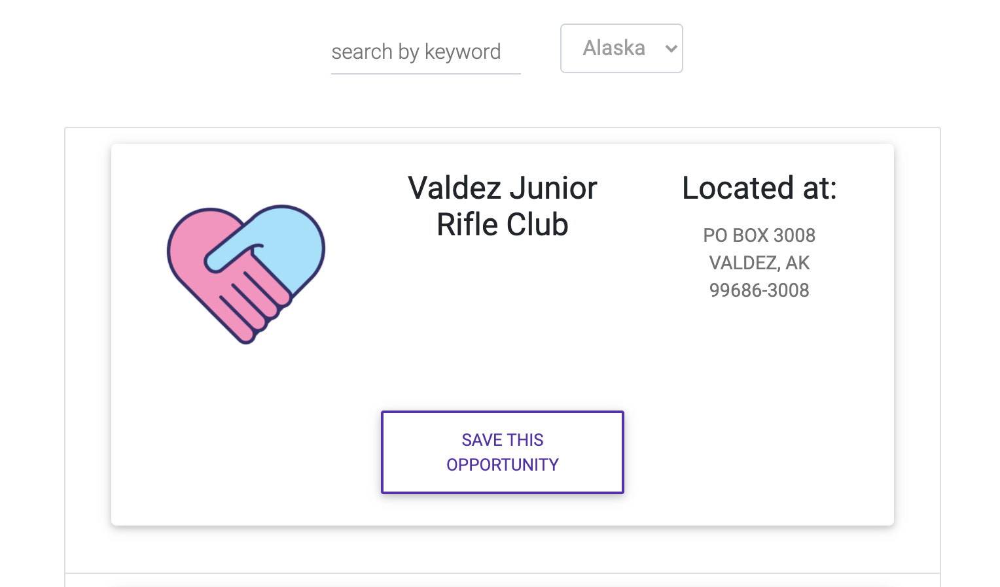
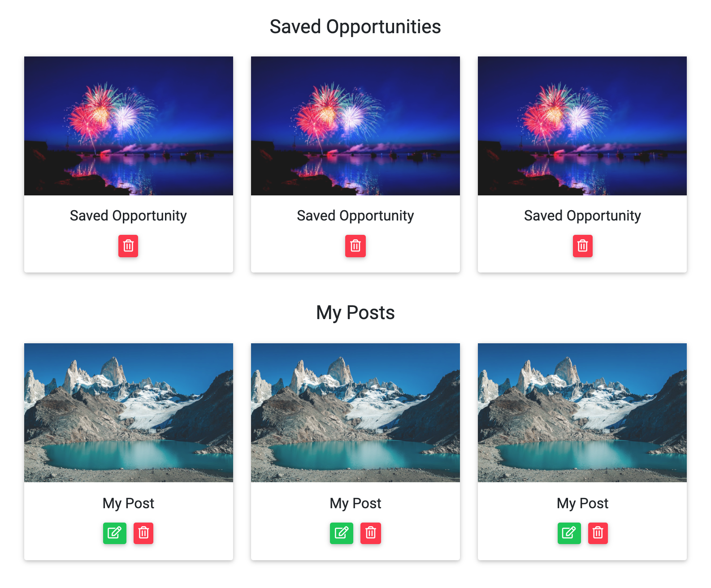
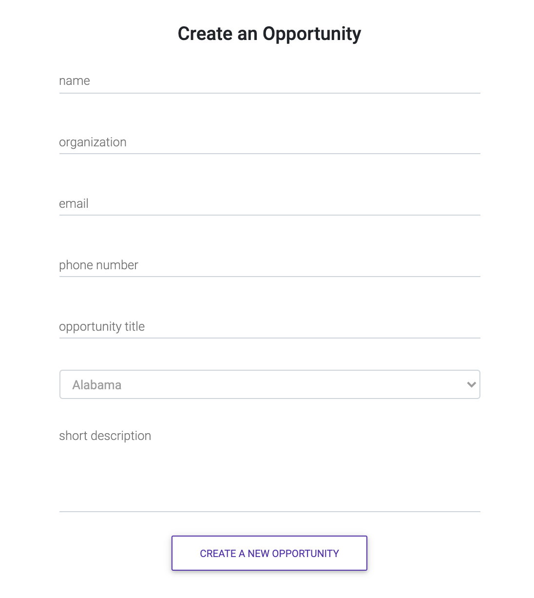

# 

## Description

Assist utilizes the Charity Navigator API to connect users with volunteer and community engagement opportunities. This is Project 3 for University of Central Florida's Fullstack Coding Bootcamp. Contributors include Alyssa DeMetro and Bridget Shannon.

## Table of Contents

- [Technologies](#technologies)
- [Features](#features)
- [Work In Progress](#work-in-progress)
- [Usage](#usage)

## Technologies

_Languages_


_Stack_

- _MongoDB_
- _Express_
- _React_
- _Redux_
- _Node_

_API_

- _Charity Navigator API:_ https://www.charitynavigator.org/index.cfm?bay=content.view&cpid=1397

_CSS_

- _MDBootstrap:_ https://mdbootstrap.com/docs/react/

## Features

- When users arrive at the home page, they are prompted with a call to action to either `login` or `signup`.



- Once users log in or sign up, they are redirected to the `search` page.

  

  

  - This page allows users to search for an opportunity by keyword and filter by state.

  - Users are presented with their search `results`; the opportunity, who to contact about the opportunity, and the option to save.

  

- Users can access their saved opportunities and any opportunities they have created on their `profile`. Here, users can delete any saved opportunities and edit or delete any they have created.

  

- If a user would like to add an opportunity, they click `create` in the navbar. This brings users to a create form where they can submit their opportunity.

  

## Work In Progress

The following features of the Assist application are works in progress or (WIP).

- Rendering content from `create form` onto cards that render to a user's `profile` and displays in the `search`
- User can `save` opportunities to their `profile`
- Using an additional `API` to pull from even more opportunities
- Creation of `calendar` page so users can manage their opportunities and see upcoming events near them
- Color-code `search` result cards based on when the event is happening. Grey = past, red = currently happening, yellow = in a few days, green = 1+ week(s) away.

## Usage

- [Heroku](https://github.com/bridgetrshannon/Assist)
- [GitHub](https://github.com/bridgetrshannon/Assist)

```
git clone https://github.com/bridgetrshannon/Assist.git
```
